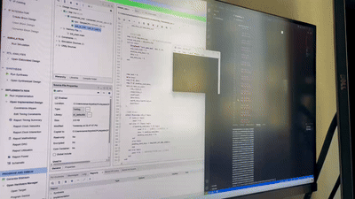
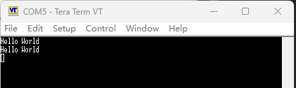
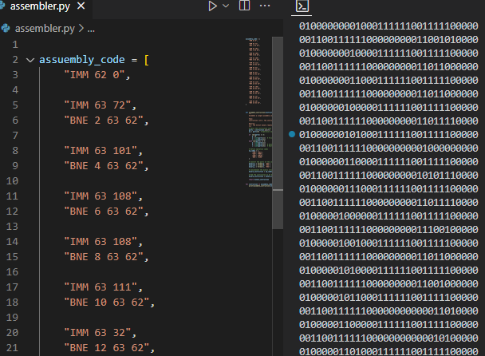

# マイミニCPU

これは、FPGA上で開発された、'Hello world'のみを印刷できるCPUを展示するための私の個人プロジェクトです。

[](Docs/showcase.gif)

出力部分の拡大図：



# 開発環境

- Arty S7 FPGA：https://digilent.com/reference/programmable-logic/arty-s7/start
- Vivado 2021.1

# CPUの特徴

できるだけシンプルにしたいので、このCPUは以下の4つの命令のみをサポートしています：

- ADD
- SUB
- IMM
- BNE

各命令は直接メモリに操作を行います。レジスタ計算命令はありません。

命令セットは次に触発されました：

[Simple ISA](https://courses.cs.washington.edu/courses/cse378/02sp/slides/simple-isa.html)

## メモリ

CPUは64 x 32ビットメモリを提供し、約0.2KBです。

コードセグメントとデータセグメントは0.2KBのメモリを共有しています。

## デバッグ出力

`[63]`メモリアドレスはUARTデバッグ出力に使用されます。ここに配置された任意のデータは、開発ホストのシリアルポートにUARTによって出力されます。これにより、テキストを印刷できます。

# アセンブラー

私は非常にシンプルなPythonアセンブラーを実装しました。ChatGPTに感謝します。

このアセンブラーは上記の4つの命令をサポートし、最終的なメモリマシン命令コードファイルを生成することができます。



# 実装の詳細

## CPUアーキテクチャ

CPUにはIF、EX、WBの3つの主要な段階が含まれています。できるだけ実装を簡素化するために、パイプライン形式を採用していませんが、CPUは一度に1段階ずつ実行します。

命令が直接メモリにアクセスするため、メモリ読み書きプロセス中の遅延を考慮する必要があります。このため、IF段階は4つのサブステージに分けられています：
- IF0：命令読み取り
- IF1 - 4：オペランドa、b、cの読み取り

各メモリ読み取りには遅延があるため、IF段階の各サブステージは5つのクロックサイクルを待ちます。

これは確かに非常に良い実装ではありませんが、このデモを完成させるには十分です。できるだけ問題を簡素化したいだけです。

## 印刷出力

URATモジュールは`[63]`メモリを読み取ろうとします。0でない場合、デバッグ出力と見なされます。最初にこのメモリをクリアし、次に結果をシリアルポートに出力します。

ただし、URATモジュールの出力頻度は、メインCPUの実行頻度と一致していません。したがって、1文字を出力するためには、以下のテクニックが必要です：

```assembly
    IMM 62 0
    IMM 63 72
    BNE 2 63 62
```

まず、[62]に数値0を置き、[63]メモリに数値72（つまり、'H'のASCII）を入れます。次に、[63]メモリが0になるまでBNEでポーリング待ちします。

これは、UARTがこの文字を正常に出力したことを意味します。

いくつかの問題
実際のテストでは、Resetを繰り返し押すと、システムが機能しなくなり、hello worldを連続して出力する可能性があります