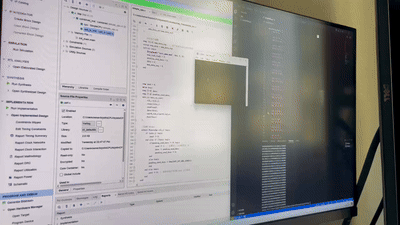

# My Mini CPU

[English](https://github.com/ldl19691031/MyMiniCPU/blob/master/README-en.md)

[日本語](https://github.com/ldl19691031/MyMiniCPU/blob/master/README-jp.md)

这是我的一个个人项目，用于展示一个基于FPGA开发的、能且只能够打印'Hello world'的CPU。

[](Docs/showcase.gif)

输出部分的放大图：


# 开发环境

- Arty S7 FPGA : https://digilent.com/reference/programmable-logic/arty-s7/start
- Vivado 2021.1

# CPU特性

我希望尽可能让事情变得简单，因此这个CPU只支持4个指令：

- ADD
- SUB
- IMM
- BNE

每一个指令都直接针对内存进行操作，没有寄存器计算指令。

指令集的灵感来自于：

[Simple ISA](https://courses.cs.washington.edu/courses/cse378/02sp/slides/simple-isa.html)

## 内存

CPU提供了64 x 32bit 内存，大约0.2KB

代码段与数据段共享0.2KB内存

## 调试输出

内存的`[63]`号地址被用于UART调试输出。任何被放置在这里的数据，都会被UART输出到开发主机的串口上。这能够让我们可以打印文字。

# 汇编器

我实现了一个极为简单的Python汇编器。感谢ChatGPT。

这个汇编器支持上面的4个指令，并能够生成最终的内存机器指令代码文件。


# 实现细节

## CPU架构

CPU包含三个主要阶段：IF、EX、WB。为了尽可能简化实现，我没有采用流水线形式，而是CPU会一个阶段一个阶段地执行。

其中由于指令直接访存，因此需要考虑到内存读写过程中的延迟。为此IF阶段被划分为了4个子阶段：
- IF0 : 指令读取
- IF1 - 4 ：操作数a、b、c读取

由于每一次内存读取都会有延时，因此IF阶段每一个子阶段都会等待5个时钟周期。

这确实不是一个非常好的实现，但是足够完成这一个Demo。我只希望尽可能地让问题简单化。

## 打印输出

URAT模块会试图读取`[63]`号内存，如果不为0，则视为调试输出。会首先将该内存清零，然后输出结果到串口。

但是，URAT模块的输出频率与主CPU的运行频率并不统一，因此需要以下技巧来实现输出1个文字：

```assembly
    IMM 62 0
    IMM 63 72
    BNE 2 63 62
```

首先在[62]处放入数字0，然后给[63]号内存放入数字72（即‘H’的ASCII）。然后利用BNE轮询等待[63]号内存变为0

这意味着UART已经成功输出了这个字符。


# 一些问题

- 在实际测试的时候，反复按下Reset有一定的可能性让系统无法工作，连续输出hello world